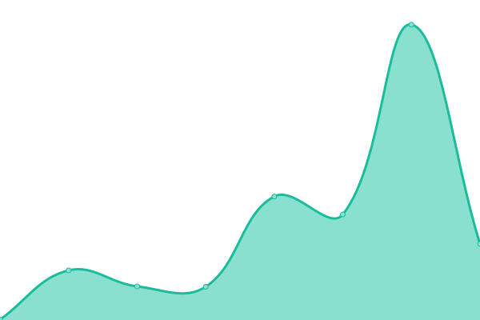
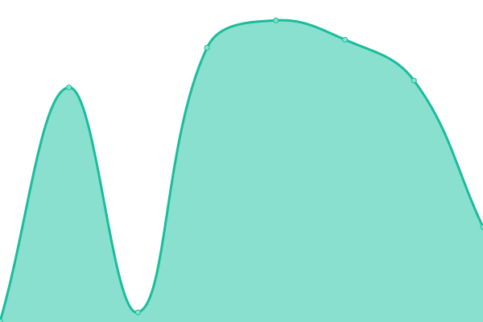
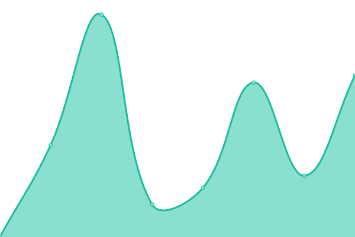
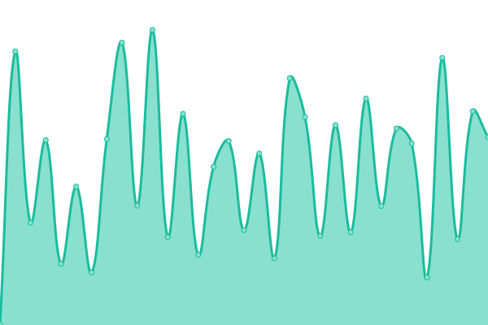
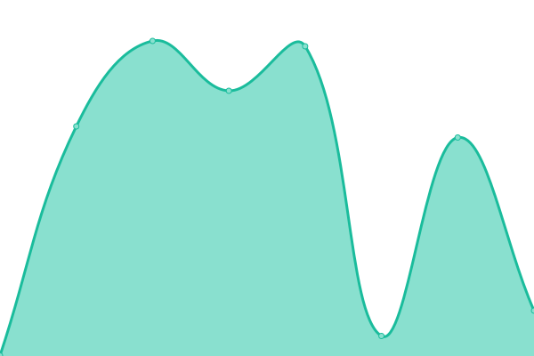

# [📈 Live Status](https://Nirmitjatana.github.io/uptime): <!--live status--> **🟧 Partial outage**

This repository contains the open-source uptime monitor and status page for [Nox_codes](https://Nirmitjatana.github.io/uptime), powered by [Upptime](https://github.com/upptime/upptime).

With [Upptime](https://upptime.js.org), you can get your own unlimited and free uptime monitor and status page, powered entirely by a GitHub repository. We use [Issues](https://github.com/Nirmitjatana/uptime/issues) as incident reports, [Actions](https://github.com/Nirmitjatana/uptime/actions) as uptime monitors, and [Pages](https://Nirmitjatana.github.io/uptime) for the status page.

<!--start: status pages-->
<!-- This summary is generated by Upptime (https://github.com/upptime/upptime) -->
<!-- Do not edit this manually, your changes will be overwritten -->
<!-- prettier-ignore -->
| URL | Status | History | Response Time | Uptime |
| --- | ------ | ------- | ------------- | ------ |
|  [IRIS](https://iris.dscvit.com) | 🟩 Up | [iris.yml](https://github.com/Nirmitjatana/upptime-personal/commits/HEAD/history/iris.yml) | 

 373ms
     
 | 

<a href="https://Nirmitjatana.github.io/uptime/history/iris">0.00%</a>
    

|  [SocioCredz](https://sociocredz.netlify.app/) | 🟩 Up | [socio-credz.yml](https://github.com/Nirmitjatana/upptime-personal/commits/HEAD/history/socio-credz.yml) | 

 343ms
     
 | 

<a href="https://Nirmitjatana.github.io/uptime/history/socio-credz">100.00%</a>
    

|  [Spike App](https://www.spikeapp.tech/) | 🟥 Down | [spike-app.yml](https://github.com/Nirmitjatana/upptime-personal/commits/HEAD/history/spike-app.yml) | 

 0ms
     
 | 

<a href="https://Nirmitjatana.github.io/uptime/history/spike-app">0.00%</a>
    

|  [Covid-19 India](https://www.covid19india.org/) | 🟥 Down | [covid-19-india.yml](https://github.com/Nirmitjatana/upptime-personal/commits/HEAD/history/covid-19-india.yml) | 

 461ms
     
 | 

<a href="https://Nirmitjatana.github.io/uptime/history/covid-19-india">96.26%</a>
    

|  [Portal](https://rekursion-vithack2020.netlify.app/) | 🟩 Up | [portal.yml](https://github.com/Nirmitjatana/upptime-personal/commits/HEAD/history/portal.yml) | 

 419ms
     
 | 

<a href="https://Nirmitjatana.github.io/uptime/history/portal">100.00%</a>
    

<!--end: status pages-->

[**Visit our status website →**](https://Nirmitjatana.github.io/uptime)

## 📄 License

- Powered by: [Upptime](https://github.com/upptime/upptime)
- Code: [MIT](./LICENSE) © [Nox_codes](https://Nirmitjatana.github.io/uptime)
- Data in the `./history` directory: [Open Database License](https://opendatacommons.org/licenses/odbl/1-0/)
